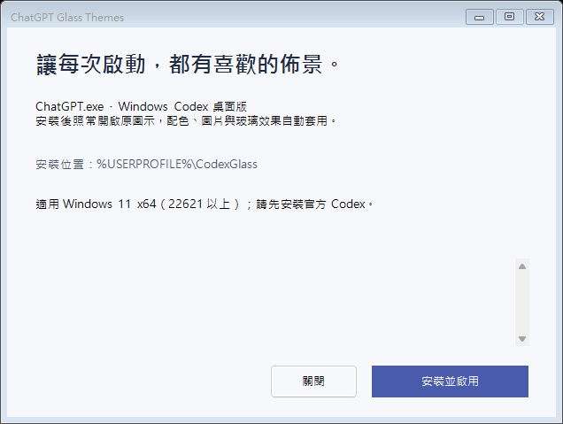

# Codex Glass Themes

[English](README.md) · [繁體中文](README.zh-TW.md)

替 Windows Codex 加上玻璃背景、自訂配色與本機圖片。**安裝一次，以後照常從開始功能表或工作列開啟 Codex，背景助手就會自動套用主題。**

**[下載 Windows x64 安裝程式](https://github.com/mabyes1/codex-glass-themes/releases/latest)** · [從原始碼建置](packaging/README.md#繁體中文)

本專案的對象是 **官方 `OpenAI.Codex` Windows 套件裡的 `ChatGPT.exe`**。辨識依據包含套件身分，其他同名執行檔不在目前支援範圍內。本工具為獨立社群專案，與 OpenAI 無隸屬關係。

## 可以調整什麼？

- 清透玻璃、漸層配色，或自己的背景圖片。
- 六組精選配色，可分別微調底色與左右光暈。
- 背景濃度、毛玻璃、圖片暗化及閱讀舒適度。
- 保持文字與按鈕清晰，讓透明效果主要作用於背景。
- 一鍵還原 Codex 原始外觀。

偏好保存在原本的 Codex 瀏覽器資料中，圖片存於本機 IndexedDB。支援 PNG、JPEG、WebP、AVIF，每張上限 12 MB。目前安裝介面與佈景面板使用繁體中文。

## 系統需求

| 項目 | 支援範圍 |
| --- | --- |
| 作業系統 | Windows 11，組建 22621 以上 |
| 架構 | x64；此安裝包尚未支援 ARM64 |
| 應用程式 | 官方 Windows Codex，套件名稱 `OpenAI.Codex` |
| 帳戶 | 使用平常操作 Codex 的 Windows 帳戶安裝 |
| 執行環境 | 已內附 Node.js，使用者不必另外安裝 Node.js 或 npm |

安裝使用目前帳戶權限，不要求管理員提升。若 Windows 政策封鎖 PowerShell、套件除錯或工作排程，可能無法安裝。安裝程式會在啟用助手前檢查環境並回報衝突。

## 安裝與使用

1. 先安裝官方 Windows x64 Codex 桌面版。
2. 從 [Releases](https://github.com/mabyes1/codex-glass-themes/releases/latest) 下載 `ChatGPT-Glass-Themes-Setup-1.0.0-win-x64.exe`。
3. 使用平常的 Windows 帳戶執行，按 **「安裝並啟用」**。預設安裝於 `%USERPROFILE%\CodexGlass`。
4. 若 Codex 已在執行，先完成手邊工作，**完整退出一次**，再從原本的圖示開啟。只關閉視窗可能仍有背景程序。
5. 點視窗上方的 **「佈景」**，選擇 **「清透」**、**「配色」** 或 **「圖片」**。



之後登入這個 Windows 帳戶時，背景助手會自動啟動，等待 Codex 並套用儲存的外觀。**平常繼續用官方 Codex 圖示即可，不必另外開啟主題啟動器。** 使用期間請保留安裝資料夾。

安裝程式目前尚未做程式碼簽署，Windows 可能顯示未知的發行者。

### 已經裝過舊助手？

請先使用原安裝的移除功能，再安裝此版。安裝程式遇到另一套助手的登入值或啟動除錯設定，會保留並提示衝突。若先前使用的是帶有管理員 IFEO 鉤子的開發版本，移轉前也要使用原版本的還原腳本移除該鉤子。

## 更新與相容性

**官方 Codex 更新：** 助手每五秒向 Windows 查詢已安裝的套件及實際位置。版本改變時，會釋放舊回呼並替新套件重新掛載。套件版本與安裝磁碟由執行時查詢，不綁定某次官方版本。不同版本的短路徑別名分開保存，也能處理更新後舊目標已不存在的 junction。

若在更新完成後立刻啟動，可能早於下一次同步。主題未出現時，等幾秒後完整退出再開啟。未來官方若改變啟動機制、Chromium 內部結構或介面版面，仍可能需要更新本工具；無法保證每個未來版本都直接相容。

**主題工具更新：** v1.0.0 採先解除安裝、再安裝新版的方式。從 Windows 設定移除主題工具後，執行新版安裝程式。配色與圖片留在 Codex 的資料中。本工具目前尚無自動更新器。

## 還原外觀與解除安裝

只想暫時使用原始介面，可在佈景面板按 **「還原 Codex 原始外觀」**；背景助手仍保留安裝。

若要移除工具，開啟 **設定 → 應用程式 → 已安裝的應用程式 → ChatGPT Glass Themes（Codex） → 解除安裝**。移除流程會停止本工具的助手、解除套件回呼、移除登入自啟與安裝檔案。主題偏好與背景圖片保留在 Codex 的瀏覽器儲存空間。

移動或手動刪除安裝資料夾前，請先解除安裝，讓 Windows 正確釋放啟動回呼。

## 常見問題

| 狀況 | 處理方式 |
| --- | --- |
| 安裝成功，卻沒有「佈景」按鈕 | 完整退出 Codex 再開啟；回呼從新的應用程式程序開始生效。 |
| 偵測到另一套助手或除錯器 | 先用該工具的原移除或還原流程解除，再重試。 |
| 提示安裝路徑太長 | 改用自己 Windows 個人資料夾內較短的空白目錄，例如 `%USERPROFILE%\CG`。 |
| 官方更新後主題消失 | 等幾秒、完整退出並重開；若仍未恢復，查看下列紀錄。 |
| 助手檔案被移動或刪除 | 先放回原安裝位置，再執行解除安裝。避免憑猜測刪除套件除錯登錄值。 |

診斷檔案位於安裝目錄：

- `.runtime-auto/auto.log`：背景助手活動與錯誤。
- `.runtime-auto/package-hook-status.json`：回呼狀態及套件版本。`armed` 代表等待下一次新啟動。
- `.runtime-auto/live-acceptance.json`：最近一次觀察到渲染器正常、使用原資料目錄且主題已掛上的實例。請同時看時間戳記；它不是持續健康狀態保證。
- `.runtime-auto/host-error.log`：主題程序的錯誤。

技術人員可在 PowerShell 執行唯讀環境檢查：

```powershell
$setup = '.\ChatGPT-Glass-Themes-Setup-1.0.0-win-x64.exe'
& $setup --check-only --install-root "$env:USERPROFILE\CodexGlass"
```

[回報問題](https://github.com/mabyes1/codex-glass-themes/issues) 時，請附上 Windows 組建、Codex 版本、主題工具版本及相關錯誤。分享紀錄前先檢查內容，其中可能包含本機路徑、程序及套件資訊。

## 運作方式與變更範圍

安裝的是 **目前帳戶的背景助手，不是 Windows 服務**。安裝當下會用一般權限的一次性排程獨立啟動助手，之後移除排程。往後登入則由目前帳戶的 `CodexGlassThemeAutoAttach` 登入值啟動。

助手透過 Windows `IPackageDebugSettings` 取得官方套件啟動回呼。預先編譯的 helper 核對套件、帳戶、執行檔、程序建立時間及初始執行緒後，在既有參數緩衝區加入 `--remote-debugging-port=0`，隨即恢復程序。指向官方套件的短目錄 junction 用來符合緩衝區容量；主題程序再尋找本機 CDP 連線並套用主視窗樣式。

官方執行檔與套件內容保持原樣，應用程式繼續使用原本的 Codex 瀏覽器資料目錄。安裝包不含製作者的帳號、聊天、偏好、圖片或登錄備份。CDP 具有強大的除錯權限；本工具預期使用本機 loopback 監聽，不將它公開到網路。

套件除錯模式啟用期間，也會改變 Windows 對該套件的自動暫停、恢復與終止行為。這不是官方主題擴充介面，詳見 [Microsoft 套件除錯文件](https://learn.microsoft.com/en-us/windows/win32/api/shobjidl_core/nf-shobjidl_core-ipackagedebugsettings-enabledebugging) 與 [原始碼／建置說明](packaging/README.md#繁體中文)。

## 目前驗證到哪裡？

原方案已在開發機完成實際冷啟動：從官方入口開啟後，渲染器正常，CDP 與主題自動掛上，原資料目錄中的配色及圖片也已帶回。

分發安裝器已通過解包、獨立目錄部署、內附執行環境與原生助手、既有安裝保護、更新留下的失效 junction 恢復，以及移除時不遍歷 junction 目標的檢查。**尚待在第二台乾淨 Windows 電腦完成安裝、啟動及解除安裝全流程。** 現有結果不等於所有電腦或未來 Codex 版本都已驗收。

## 原始碼與內附軟體

本倉庫包含安裝器、啟動回呼、主題檔案與相關測試。目錄與指令見 **[建置與測試](packaging/README.md#繁體中文)**。安裝包內附未修改的 [Node.js 24.21.0 Windows x64 執行環境](https://nodejs.org/dist/v24.21.0/)，授權與第三方聲明安裝於 `runtime/NODE-LICENSE.txt`。
